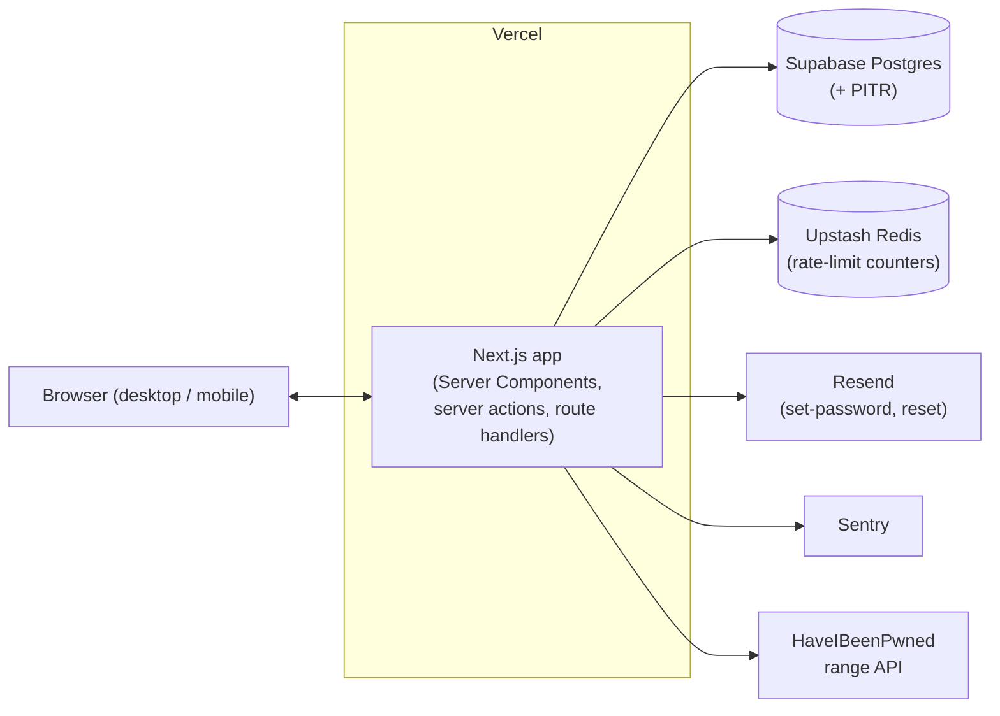
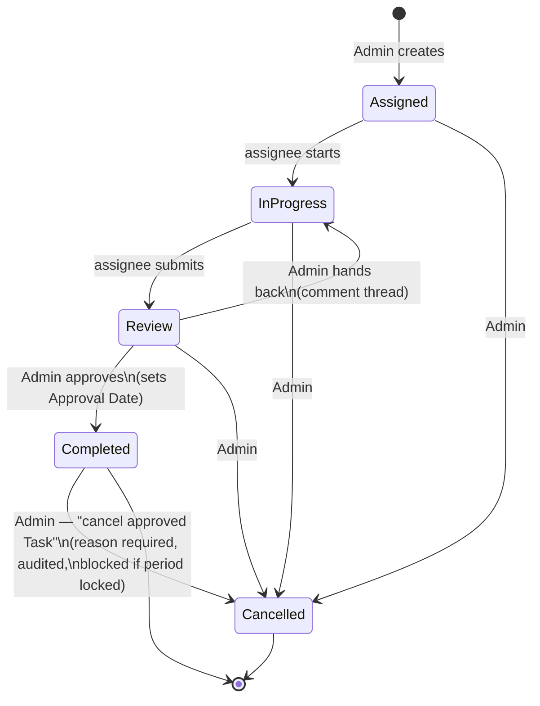

# Light Advert — Architecture (Phase 1)

## 1. Overview

A single **Next.js (App Router)** application deployed to **Vercel**, backed by a
**Postgres** database on **Supabase**. The app serves the internal tool under an
authenticated `/app` area and performs mutations through server actions and route
handlers. Phase 2's public marketing site will be added as unauthenticated routes in the
same app; Phase 1 ships only a minimal placeholder landing plus login.

The system is small — single-digit to low-double-digit users, hundreds of Tasks per
month. It is deliberately a **modular monolith**, not a set of services. See
[ADR-0004](adr/0004-single-app-postgres-vercel.md).

## 2. Stack

| Concern | Choice | Notes |
|---|---|---|
| Web framework | Next.js 16 (App Router) + TypeScript | Server Components + server actions for mutations; Turbopack |
| Styling / UI | Tailwind v4 + shadcn/ui (`tw-animate-css`) | Light mode only; tokens ready for a later dark mode |
| Database | Postgres (Supabase) | Point-in-time recovery enabled |
| ORM / migrations | Prisma 6 (pinned to 6.19.3) | One schema, migrations in the repo. See §2.1 |
| Auth | Better Auth | Email + password, database sessions, no OAuth |
| Transactional email | Resend | Set-password and reset only in Phase 1 |
| Rate limiting | Upstash Redis (`@upstash/ratelimit`) | Shared state for login / credential throttling |
| Hosting | Vercel | Production project + per-PR preview deploys; no separate staging |
| Error monitoring | Sentry (`@sentry/nextjs` v10) | Client + server; wraps the build only when `SENTRY_DSN` is set |
| Runtime / tooling | Node 20 LTS (dev on 24 works), pnpm 9 | |
| Tests | Vitest (unit) + Playwright (e2e) | Thin, focused suite — see §11 |
| CI | GitHub Actions | `db:generate` + typecheck + lint + test on PR |

### 2.1 Version pins

- **Prisma is pinned to 6.19.3.** Prisma 7+ removes `datasource { url = env(...) }`, requires
  a driver adapter passed to `new PrismaClient()`, moves connection config to
  `prisma.config.ts`, and switches to the `prisma-client` generator. Adopting that is a
  deliberate later step, not a scaffold concern.
- `create-next-app` produced **Next 16** (not 15 as first sketched); `@sentry/nextjs` v10
  supports it.
- `lucide-react` is v1.x (the icon API is unchanged from 0.x).

## 3. Deployment topology



## 4. Application structure

```
src/
  instrumentation.ts        # Sentry server/edge register + onRequestError
  instrumentation-client.ts # Sentry browser init (guarded by NEXT_PUBLIC_SENTRY_DSN)
  app/
    page.tsx                # Phase 2 placeholder landing + link to /login
    (auth)/
      login/                # sign-in form (client, calls Better Auth)
    app/                    # authenticated internal tool
      layout.tsx            # requireUser() guard + nav
      page.tsx              # Staff home (R43)
      admin/               # Admin-only; requireAdmin() in admin/layout.tsx
        page.tsx            # overview
        projects/ tasks/ reports/ workload/ roles/ staff/ audit/   # one stub each
    api/
      auth/[...all]/        # Better Auth handler (toNextJsHandler)
  server/
    auth/                   # Better Auth config (index.ts) + guards.ts
    db/                     # Prisma client singleton; query modules per aggregate (later)
    domain/                 # pure logic: effort, task-status, pay-period, contribution, audit
    email/                  # Resend wrapper (resend.ts)
    ratelimit/              # Upstash wrapper (upstash.ts)
  components/               # shadcn-based UI (planned.tsx placeholder for now)
  lib/                      # utils.ts (cn), dates.ts (EAT helpers), auth-client.ts
prisma/
  schema.prisma
  seed.ts                   # 7 Roles + first Admin + Internal / Ad-hoc Project
sentry.server.config.ts
sentry.edge.config.ts
```

The authenticated area lives under a real `app/admin` segment rather than an `(admin)`
route group — two route groups cannot both own `/app`. `requireUser()` gates `/app/**`
in `app/app/layout.tsx`; `requireAdmin()` gates `/app/admin/**` in `app/app/admin/layout.tsx`.

**Principle:** every pay-relevant rule lives in `server/domain` as pure, unit-tested
functions, with the database and framework at the edges. Route handlers and server
actions *orchestrate* — they never contain contribution math or transition rules.

## 5. Authentication & authorization

- **Better Auth** with the email/password credential flow; sessions stored in Postgres.
- **No public signup.** Account creation is an Admin action that provisions the user and
  sends a one-time set-password link via Resend. Password reset uses the same mechanism.
- **Password policy:** minimum 8 characters; the candidate's SHA-1 prefix is checked
  against the HaveIBeenPwned range API and rejected on any suffix match. No complexity
  rules, no rotation.
- **Session policy:** 30-day rolling expiry for everyone. Admin sessions additionally
  carry a 2-hour inactivity timeout, checked server-side on each request.
- **Account role:** `ADMIN` or `STAFF`, an attribute of the account. Multiple Admins are
  allowed; an Admin can promote or demote another account. The system refuses to remove
  the **last active Admin**.
- **Authorization:** every `/app/(admin)` route and every admin mutation checks
  `role === ADMIN`. Staff mutations additionally check `task.assigneeId === session.userId`.
  All checks are server-side; hiding UI is cosmetic.
- **Login throttling:** per-IP and per-account counters in Upstash with exponential
  backoff; one generic error for unknown user, wrong password, and locked account.

## 6. Data layer

Prisma over Postgres. Query logic is grouped by aggregate (`staff`, `role`, `project`,
`task`, `payPeriod`, `audit`) under `server/db`. Raw SQL is not expected in Phase 1 except
possibly the report aggregation if Prisma grouping proves awkward.

Full schema, enums and invariants: [data-model.md](data-model.md).

**Key indexes**

| Index | Serves |
|---|---|
| `Task(status, approvalDate)` | Contribution Report — the hot path |
| `Task(assigneeId, status)` | Staff home, Workload Board |
| `Task(projectId)` | Project views, "delete only if empty" check |
| `AuditEntry(taskId, createdAt)` | Audit shown inline on a Task |
| `AuditEntry(actorId, createdAt)` | Audit screen filters |

## 7. Core workflows

### 7.1 Task lifecycle



Notes:
- Only the **assignee** moves a Task into Review. Only an **Admin** approves, cancels, or
  hands back.
- Cancelling a not-yet-approved Task needs **no reason**. Cancelling a **Completed** Task
  is a distinct audited action that **requires a reason** and is **blocked if the Task's
  period is locked**; it removes the Task's Contribution.
- **Backfill:** an Admin may create a Task directly in any status (usually Completed) with
  a past Approval Date, **only** if that date is in no locked window. It is flagged
  `manuallyRecorded` and writes a `TASK_MANUALLY_RECORDED` Audit Entry capturing initial
  values.

### 7.2 Assignment

Admin picks Project, assignee, Role (default = assignee's Primary Role; overriding to a
Role the assignee lacks is allowed with a soft warning), Effort Estimate, and optional
fields → Task is created in **Assigned**. No Audit Entry at creation for a normal Task
(the estimate is being set for the first time); a backfilled Task is the exception.

### 7.3 Approval and Contribution crediting

Admin moves `Review → Completed`. The server sets `approvalDate = now()` (EAT) and
`approvedById`. **Contribution is never stored as a number** — it is always derived: a Task
contributes `effortPoints` to its `assigneeId` in the date bucket containing
`approvalDate`, whenever `status = COMPLETED`. A Task reassigned before approval simply has
`assigneeId = B` at approval time, so B is credited (see
[ADR-0001](adr/0001-effort-points-not-hours.md)).

### 7.4 Pay-period lock / unlock

**Lock** — Admin selects a period (a month or a custom range). The system records a
`PayPeriodLock(startDate, endDate, lockedById, lockedAt)` and writes `PERIOD_LOCKED`.
On every write path that touches a Task's `effortPoints` or `approvalDate`, the domain
layer checks whether that Task's `approvalDate` falls inside any active lock window and
**refuses the edit** if so.

**Unlock** — Admin closes the lock (`unlockedById`, `unlockedAt`, `unlockReason`), which
writes `PERIOD_UNLOCKED`. Unlock **requires a typed reason**.

Edge case: a Task in Review when a period is locked has no `approvalDate` yet and is
unaffected. When it is later approved, `approvalDate = now`, which is necessarily outside
the locked window, so it lands in a later, open period. No conflict arises.

### 7.5 Contribution Report computation

```
input:  dateRange (default = current calendar month, EAT), roleFilter?
select  Task where status = COMPLETED
              and approvalDate in [start, end]
              and (roleFilter is null or stampedRoleId = roleFilter)
group   by assigneeId                       -> per-person total
group   by (assigneeId, stampedRoleId)      -> per-Role rows
left-join the full roster (active + previously-active-with-history)
              -> people with no approved Tasks show as 0
company total = sum over people, each counted once
CSV     = one row per approved Task + per-person and grand total rows
```

A locked period recomputes live; its inputs are frozen, so the result is stable.

## 8. Audit logging

A single append-only `AuditEntry` table, written **by the domain layer** (never by UI
code) inside the **same transaction** as the change it records. `reason` is required by the
domain layer for `ESTIMATE_CHANGED`, `STAMPED_ROLE_CHANGED`, `TASK_REASSIGNED`,
`PERIOD_UNLOCKED`, and `APPROVED_TASK_CANCELLED`. Rows are never updated or deleted and are
retained indefinitely. It is surfaced inline on the Task and in an Admin-only filterable
screen (by Task, Staff Member, date, event type).

## 9. Deliverables & files

No file storage. A Deliverable is `{ label, url }` on a Task, with syntactic URL
validation only — no host allowlist, no fetching, no preview. This keeps multi-GB video
out of the system entirely; see [ADR-0003](adr/0003-deliverables-are-links.md).

## 10. Email

Resend, two templates in Phase 1: **set password** (on account creation) and **reset
password**. Both use single-use, time-limited, signed tokens. No other notifications exist
in Phase 1.

## 11. Testing

Deliberately thin, concentrated where a defect costs money.

- **Unit (Vitest):** contribution summation and bucketing by Approval Date; Role-filtered
  totals; status-transition guard (who may do what); estimate-edit audit + reason
  enforcement; lock / unlock enforcement; "last Admin" protection; HIBP check wrapper.
- **E2E (Playwright):** account set-password flow; assign → start → review → approve →
  appears in report; lock a period then fail an edit; reassign then approve credits the new
  assignee; CSV totals reconcile with the screen.

Broad CRUD-screen coverage is explicitly not a Phase 1 goal.

## 12. Environments & CI

- **Production** Vercel project + Supabase project. **No separate staging** — per-PR Vercel
  preview deploys run against a disposable preview database branch.
- **GitHub Actions** on PR: `pnpm typecheck`, `pnpm lint`, `pnpm test`. Playwright runs
  against the preview deploy.
- Server env (Vercel project settings): `DATABASE_URL`, `BETTER_AUTH_SECRET`,
  `RESEND_API_KEY`, `UPSTASH_REDIS_REST_URL`, `UPSTASH_REDIS_REST_TOKEN`, `SENTRY_DSN`,
  `SEED_ADMIN_EMAIL`, `SEED_ADMIN_NAME`.

## 13. Observability

Sentry for client and server errors. No product analytics in Phase 1. Application logs via
Vercel.

## 14. Security notes

- All authorization server-side; Server Components fetch already-scoped data, mutations
  re-check.
- Session cookies: `httpOnly`, `secure`, `SameSite=Lax`.
- CSRF: mutations run through server actions / same-site POST; state-changing route
  handlers verify origin.
- Rate limiting on login and on the set-password / reset endpoints.
- No secrets in the client bundle; the only `NEXT_PUBLIC_*` value is the Sentry DSN.
- The Audit trail is the tamper-evidence mechanism for pay data: append-only in the
  application, and DB write access restricted to the app role so history cannot be quietly
  rewritten.

## 15. Phase 2 hooks (not built)

- Marketing routes slot into `app/(marketing)`.
- A notification model + Resend templates + a Vercel Cron job for deadline reminders.
- Calendar / timeline view over existing Task deadline data.
- **Manager role:** a third `role` value plus a Staff-Member scoping table; the
  authorization layer is already centralised to extend.
- **2FA:** a Better Auth plugin.
