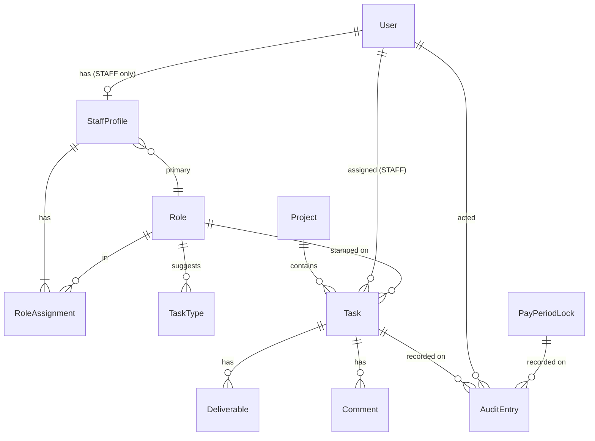

# Light Advert — Data Model (Phase 1)

All timestamps are stored in UTC and presented in **Africa/Nairobi (EAT, UTC+3)**. "Date"
semantics — which calendar month an Approval falls in — are computed in EAT.

Glossary terms (Staff Member, Role, Project, Task, …) are defined in
[../CONTEXT.md](../CONTEXT.md). This document is the implementation-level schema and names
more entities than the glossary. In particular the glossary's **Staff Member** and
**Admin** are one `User` row (Better Auth's identity table) plus, for a Staff Member, one
`StaffProfile`. Better Auth also owns `Session`, `Account` (provider credentials — *not*
the person), and `Verification`.

As-built, the schema uses Postgres **enums** for `TaskStatus`, `Priority`, `ProjectStatus`
and `AuditEventType`, but stores `User.role` and `User.status` as **plain `String`s**
(`"ADMIN" | "STAFF"`, `"ACTIVE" | "DEACTIVATED"`) so Better Auth's `additionalFields` map
cleanly. Allowed values are enforced in `src/server/auth` and `src/server/domain`. Table
names are `snake_case` via `@@map`.

## Enums

| Enum | Values | As-built |
|---|---|---|
| `UserRole` | `ADMIN`, `STAFF` | `String` on `user` |
| `UserStatus` | `ACTIVE`, `DEACTIVATED` | `String` on `user` |
| `TaskStatus` | `ASSIGNED`, `IN_PROGRESS`, `REVIEW`, `COMPLETED`, `CANCELLED` | Postgres enum |
| `Priority` | `LOW`, `NORMAL`, `HIGH`, `URGENT` | Postgres enum |
| `ProjectStatus` | `ACTIVE`, `ARCHIVED` | Postgres enum |
| `EffortPoints` | integer constrained to `{1, 2, 3, 5, 8, 13}` | `Int`, app-enforced (`src/server/domain/effort.ts`) |
| `AuditEventType` | `ESTIMATE_CHANGED`, `STAMPED_ROLE_CHANGED`, `TASK_APPROVED`, `TASK_REASSIGNED`, `TASK_MANUALLY_RECORDED`, `PERIOD_LOCKED`, `PERIOD_UNLOCKED`, `APPROVED_TASK_CANCELLED` | Postgres enum |

## Entities

### User
The login identity (Better Auth `user` table). The glossary's Staff Member / Admin.

| Field | Type | Notes |
|---|---|---|
| id | uuid | PK |
| email | string | unique; **is the login identifier** |
| name | string | |
| emailVerified | bool | Better Auth |
| role | string | `ADMIN` \| `STAFF` |
| status | string | `ACTIVE` \| `DEACTIVATED` = cannot log in, no new assignments |
| createdAt / updatedAt | timestamptz | |

Password hashes live in Better Auth's `account` table; sessions in `session`.

**Rules**
- A `STAFF` user has exactly one `StaffProfile`. An `ADMIN` user has no profile and earns
  no Contribution.
- The last `ACTIVE` `ADMIN` cannot be deactivated or demoted.
- Never hard-deleted once referenced by any `Task` or `AuditEntry`; deactivate instead.

### StaffProfile
Per–Staff Member data.

| Field | Type | Notes |
|---|---|---|
| userId | uuid | PK, 1–1 with `User` |
| primaryRoleId | uuid | FK → `Role`; must be among the assigned Roles |

Has one or more `RoleAssignment` rows. Removing a Role assignment is allowed even when past
Tasks are stamped with that Role — the stamp is independent of the person's current Roles.

### Role

| Field | Type | Notes |
|---|---|---|
| id | uuid | PK |
| name | string | unique |
| isSeed | bool | true for the 7 seeded specialties |
| orderIndex | int | display / suggestion order |
| createdAt | timestamptz | |

**Rules:** rename anytime; **cannot be deleted** while referenced by any `RoleAssignment`
or `Task.stampedRoleId`. Seeded with Content Creator, Camera Operator, Script Writer, Voice
Over Artist, Video Editor, Graphic Designer, Motion Graphic Designer.

### RoleAssignment
Join between `StaffProfile` and `Role`. Unique `(staffProfileId, roleId)`.

### TaskType
Admin-managed suggestions only.

| Field | Type | Notes |
|---|---|---|
| id | uuid | PK |
| roleId | uuid | FK → `Role` |
| label | string | unique within the Role |

A Task's `type` is a free string, **not** a foreign key to this table.

### Project

| Field | Type | Notes |
|---|---|---|
| id | uuid | PK |
| name | string | |
| status | `ProjectStatus` | |
| deadline | date | |
| priority | `Priority` | organizational only |
| clientLabel | string? | free text |
| brief | text? | |
| isSeed | bool | true for the permanent "Internal / Ad-hoc" Project |
| createdById | uuid | FK → `User` (Admin) |
| createdAt | timestamptz | |

**Rules:** Admin-only create; **delete only if no `Task` references it**; archive anytime.

### Task

| Field | Type | Notes |
|---|---|---|
| id | uuid | PK |
| title | string | |
| projectId | uuid | FK → `Project` |
| assigneeId | uuid | FK → `User` (role `STAFF`); exactly one |
| stampedRoleId | uuid | FK → `Role`; exactly one; the Role this Task counts under |
| effortPoints | int | in `{1,2,3,5,8,13}` |
| status | `TaskStatus` | |
| type | string? | free-form label |
| deadline | date? | effective deadline = `deadline ?? project.deadline` |
| priority | `Priority` | organizational only |
| brief | text? | |
| approvalDate | timestamptz? | set only on transition to `COMPLETED` |
| approvedById | uuid? | FK → `User` (Admin) |
| manuallyRecorded | bool | default false; true for backfilled Tasks |
| createdById | uuid | FK → `User` |
| createdAt / updatedAt | timestamptz | |

**Rules**
- Always has exactly one assignee, exactly one stamped Role, and a Project.
- `effortPoints ∈ {1,2,3,5,8,13}`.
- Status transitions per [architecture.md](architecture.md) §7.1. Only the assignee →
  `REVIEW`; only an Admin → `COMPLETED` / `CANCELLED` / hand-back.
- `effortPoints`, `assigneeId`, `stampedRoleId`: **Admin-only writes**; any write **after
  the status has ever left `ASSIGNED`** requires a `reason` and writes an `AuditEntry`.
- Once the containing period is locked, `approvalDate` and `effortPoints` are immutable.
- `COMPLETED` is left only via `APPROVED_TASK_CANCELLED` (Admin, reason required, audited,
  blocked when the period is locked). `CANCELLED` is terminal.
- Deletion allowed only while `status ∈ {ASSIGNED, IN_PROGRESS, REVIEW}`. A `COMPLETED`
  Task is never deleted.
- **Backfill:** may be created directly in any status with a past `approvalDate` **iff**
  that date is in no lock window; sets `manuallyRecorded = true` and writes
  `TASK_MANUALLY_RECORDED`.

### Deliverable

| Field | Type | Notes |
|---|---|---|
| id | uuid | PK |
| taskId | uuid | FK → `Task` |
| label | string | |
| url | string | syntactic validation only; no host allowlist |
| createdById | uuid | FK → `User` |
| createdAt | timestamptz | |

0..n per Task. Editable / removable by the assignee or an Admin. Not audited.

### Comment

| Field | Type | Notes |
|---|---|---|
| id | uuid | PK |
| taskId | uuid | FK → `Task` |
| authorId | uuid | FK → `User` (the assignee or an Admin) |
| body | text | |
| createdAt | timestamptz | |

**Append-only:** no update, no delete.

### PayPeriodLock

| Field | Type | Notes |
|---|---|---|
| id | uuid | PK |
| startDate / endDate | date | inclusive EAT calendar dates |
| lockedById | uuid | FK → `User` (Admin) |
| lockedAt | timestamptz | |
| unlockedById | uuid? | FK → `User` (Admin) |
| unlockedAt | timestamptz? | |
| unlockReason | string? | required when unlocking |

A Task whose `approvalDate` falls within `[startDate, endDate]` of any row **without** an
unlock is "in a locked period". Lock and unlock both write `AuditEntry` rows
(`PERIOD_LOCKED` / `PERIOD_UNLOCKED`).

### AuditEntry
Append-only, never updated or deleted, retained indefinitely. Written by the domain layer
in the same transaction as the change.

| Field | Type | Notes |
|---|---|---|
| id | uuid | PK |
| eventType | `AuditEventType` | |
| actorId | uuid | FK → `User` |
| taskId | uuid? | FK → `Task` |
| periodLockId | uuid? | FK → `PayPeriodLock` |
| field | string? | e.g. `effortPoints`, `stampedRoleId`, `assigneeId` |
| oldValue | string? | |
| newValue | string? | |
| reason | string? | **required** for `ESTIMATE_CHANGED`, `STAMPED_ROLE_CHANGED`, `TASK_REASSIGNED`, `PERIOD_UNLOCKED`, `APPROVED_TASK_CANCELLED` |
| createdAt | timestamptz | |

## Derived, never stored

- **Contribution** — never a column. Always `SUM(Task.effortPoints)` where
  `status = COMPLETED` and `approvalDate` in range, grouped by `assigneeId` (and optionally
  `stampedRoleId`).
- **Effective deadline** — `Task.deadline ?? Project.deadline`.

## ERD

## Invariants (enforced in `server/domain`, unit-tested)

1. No Task without a Project, an assignee, a stamped Role, and a valid `effortPoints`.
2. Only the assignee moves their Task to `REVIEW`; only an Admin approves / cancels / hands
   back.
3. `effortPoints` / `assigneeId` / `stampedRoleId` change **after `ASSIGNED`** ⇒ `reason` +
   `AuditEntry`.
4. No change to `effortPoints` or `approvalDate` of a Task whose `approvalDate` is in a
   locked period.
5. Approval sets `approvalDate = now` (EAT) and `approvedById` to an Admin.
6. Contribution for a reassigned Task accrues entirely to the assignee **at approval time**.
7. `CANCELLED` ⇒ contributes 0; only a separate **Kill Fee** Task can credit partial work.
8. The last active Admin cannot be removed, deactivated, or demoted.
9. Role deletion blocked while referenced; Project deletion blocked while it has any Task.
10. `Comment` and `AuditEntry` rows are append-only.
